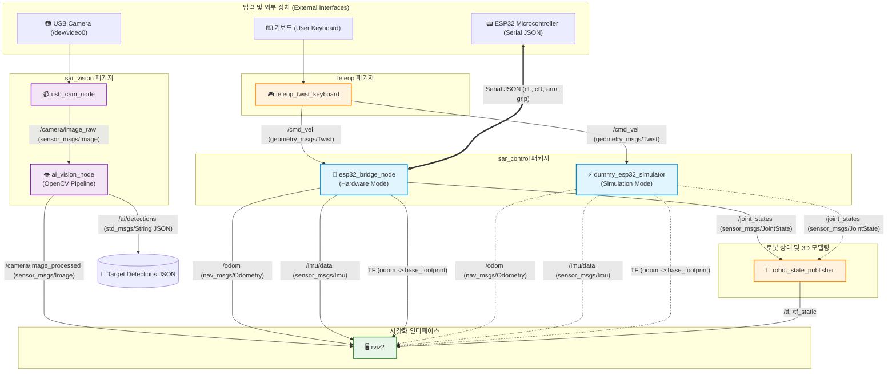
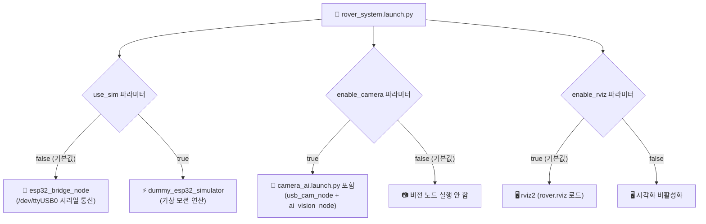

# S.A.R.v1 ROS 2 노드 구조 및 토픽 데이터 흐름 분석 문서

## 📌 1. 개요 (Overview)
본 문서는 `S.A.R.v1` (Search And Rescue Smart Autonomous Rover v1) 워크스페이스 내 ROS 2 노드(Node) 구조, 토픽(Topic) 데이터 흐름, 좌표계 변환(TF Tree), 하드웨어 인터페이스 및 시뮬레이션 분기 구조를 분석하여 도식화한 문서입니다.

* **로봇 사양**: 4WD 차동 구동 메커니즘 + 6-DOF 로봇암 + 그리퍼 + IMU 센서 + USB 카메라
* **프레임워크**: ROS 2 (Python `rclpy`)

---

## 🧩 2. 노드(Node) 목록 및 세부 역할

| 노드 이름 (Node Name) | 패키지 (Package) | 구현 소스 파일 | 주요 역할 및 기능 |
|---|---|---|---|
| **`esp32_bridge_node`** | `sar_control` | [`src/sar_control/sar_control/esp32_bridge_node.py`](file:///home/pa31/Sparta/workspace/S.A.R.v1/src/sar_control/sar_control/esp32_bridge_node.py) | **하드웨어 브리지**: 실물 ESP32 보드와 Serial JSON 통신. 4WD 차동구동 오도메트리 연산, 11개 로봇 관절 상태 및 IMU 데이터 발행 |
| **`dummy_esp32_simulator`** | `sar_control` | [`src/sar_control/sar_control/dummy_esp32_simulator.py`](file:///home/pa31/Sparta/workspace/S.A.R.v1/src/sar_control/sar_control/dummy_esp32_simulator.py) | **가상 시뮬레이터**: ESP32 미연결 시(`use_sim:=true`) 가상 오도메트리, IMU, 관절 상태 데이터 생성 |
| **`ai_vision_node`** | `sar_vision` | [`src/sar_vision/sar_vision/ai_vision_node.py`](file:///home/pa31/Sparta/workspace/S.A.R.v1/src/sar_vision/sar_vision/ai_vision_node.py) | **비전/AI 파이프라인**: OpenCV 기반 HSV 표적 색상/윤곽선 검출, FPS 계산, 좌표 정규화($-1.0 \sim 1.0$) 후 영상/JSON 발행 |
| **`usb_cam_node`** | `usb_cam` | ROS 2 기본 패키지 | **카메라 드라이버**: `/dev/video0` USB 카메라로부터 RAW 영상 프레임(640x480) 획득 및 캡처 |
| **`robot_state_publisher`** | `robot_state_publisher` | ROS 2 기본 패키지 | **3D TF 연산**: [`rover.urdf.xacro`](file:///home/pa31/Sparta/workspace/S.A.R.v1/src/sar_description/urdf/rover.urdf.xacro) URDF 파싱 및 관절 정보를 통한 키네마틱스 3D 좌표계 브로드캐스팅 |
| **`teleop_twist_keyboard`** | `teleop_twist_keyboard` | ROS 2 기본 패키지 | **원격 조종**: 키보드 입력을 기반으로 주행 속도 명령(`Twist`) 생성 |
| **`rviz2`** | `rviz2` | ROS 2 기본 패키지 | **시각화 툴**: 로봇 3D 모델, TF 트리, 오도메트리 궤적, 센서 데이터 및 비전 처리 영상 실시간 시각화 |
| **`joint_state_publisher_gui`** | `joint_state_publisher_gui` | ROS 2 기본 패키지 | **테스트 GUI**: (`display.launch.py` 전용) 슬라이더 GUI로 각 관절 각도 수동 제어 |

---

## 📐 3. ROS 2 아키텍처 및 토픽 데이터 흐름도

---

## 📡 4. ROS 2 토픽 및 메시지 타입 명세

| 토픽 이름 (Topic Name) | 메시지 타입 (Message Type) | 발행 노드 (Publisher) | 구독 노드 (Subscriber) | 역할 및 사양 |
|---|---|---|---|---|
| **`/cmd_vel`** | `geometry_msgs/msg/Twist` | `teleop_twist_keyboard` | `esp32_bridge_node` `dummy_esp32_simulator` | 로봇 선속도($x$) 및 각속도($z$) 명령 |
| **`/arm/joint_commands`** | `sensor_msgs/msg/JointState` | 외부 노드 / GUI | `esp32_bridge_node` `dummy_esp32_simulator` | 6축 로봇암 각도 및 그리퍼 작동 명령 |
| **`/odom`** | `nav_msgs/msg/Odometry` | `esp32_bridge_node` `dummy_esp32_simulator` | `rviz2` | 차동구동 엔코더 기하학 연산 기반 오도메트리 ($x, y, \theta$) |
| **`/joint_states`** | `sensor_msgs/msg/JointState` | `esp32_bridge_node` `dummy_esp32_simulator` | `robot_state_publisher` | 바퀴 4개, 로봇암 6축, 그리퍼 등 총 11개 관절 실시간 상태 |
| **`/imu/data`** | `sensor_msgs/msg/Imu` | `esp32_bridge_node` `dummy_esp32_simulator` | `rviz2` | 3축 가속도($a_x, a_y, a_z$) 및 3축 각속도($g_x, g_y, g_z$) |
| **`/camera/image_raw`** | `sensor_msgs/msg/Image` | `usb_cam_node` | `ai_vision_node` | USB 카메라 실시간 Raw 영상 프레임 (640x480 YUYV/RGB) |
| **`/camera/image_processed`**| `sensor_msgs/msg/Image` | `ai_vision_node` | `rviz2` | 비전 파이프라인 처리 후 오버레이(바운딩 박스, FPS) 포함 영상 |
| **`/ai/detections`** | `std_msgs/msg/String` | `ai_vision_node` | 외부 AI/자율주행 노드 | 타겟 좌표, 정규화 위치, 면적 정보를 담은 JSON 데이터 |

---

## ⚙️ 5. 시스템 런치(Launch) 파라미터 및 실행 분기

[`rover_system.launch.py`](file:///home/pa31/Sparta/workspace/S.A.R.v1/src/sar_bringup/launch/rover_system.launch.py) 파일에 구현된 조건부 노드 실행 구조입니다.

---

## 🦾 6. 로봇 관절(Joint) 및 좌표계(TF) 구조

### URDF 정의 관절 (11 DOF)
1. **차량 바퀴 (4WD)**: `front_left_wheel_joint`, `front_right_wheel_joint`, `rear_left_wheel_joint`, `rear_right_wheel_joint`
2. **6-DOF 로봇암**: `arm_joint1` (Yaw) $\to$ `arm_joint2` (Pitch) $\to$ `arm_joint3` (Pitch) $\to$ `arm_joint4` (Pitch) $\to$ `arm_joint5` (Roll) $\to$ `arm_joint6` (Yaw)
3. **그리퍼**: `gripper_joint` (Left Finger), `gripper_right_joint` (Mimic Joint)

### TF 좌표계 트리 (Transform Tree)
* `odom` $\xrightarrow{\text{Dynamic TF}}$ `base_footprint`
* `base_footprint` $\xrightarrow{\text{Fixed TF}}$ `base_link`
* `base_link` $\xrightarrow{\text{Kinematics TF}}$ `wheel_links` / `arm_links` / `camera_link` / `imu_link`
* `camera_link` $\xrightarrow{\text{Fixed TF}}$ `camera_optical_frame`
