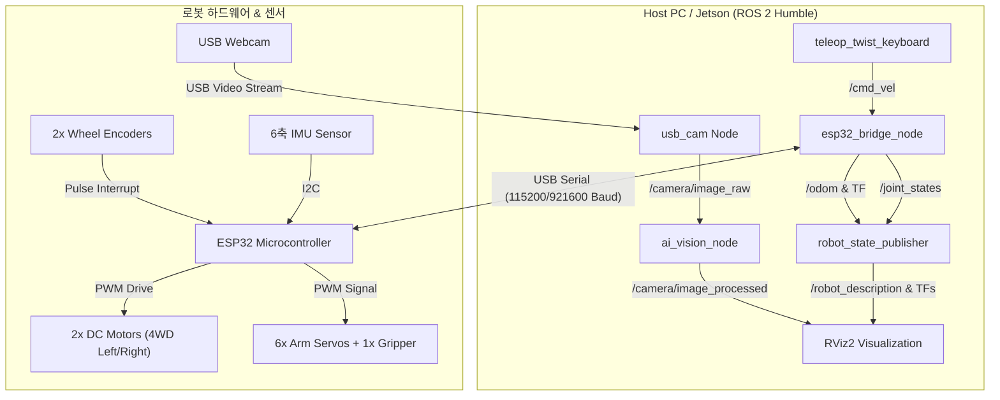

# Physical AI Rover V1 — ROS 2 시스템 구축 및 운영 가이드

> **프로젝트 개요:** 본 가이드는 **2개 DC 모터 기반의 4륜 구동(4WD) 로버 몸체**, **6축(6-DOF) 로봇팔**, 그리고 **USB 웹캠**을 장착한 Physical AI Rover의 ROS 2 (Humble) 시스템 설계, 노드 구성, ESP32 펌웨어 통신 인터페이스 및 실행 방법을 다룹니다.

---

## 1. 전체 시스템 아키텍처 (System Architecture)

Physical AI Rover는 **고수준 인공지능/ROS 2 컴퓨터(Host PC / Jetson)**와 **저수준 모터 및 서보 제어기(ESP32)**의 분산 제어 구조로 동작합니다.

### 1.1 하드웨어 및 소프트웨어 연결도



---

## 2. ROS 2 패키지 및 노드 구조 (ROS 2 Packages & Nodes)

워크스페이스 내 `src/` 디렉토리에 구축된 ROS 2 패키지 구성은 다음과 같습니다.

```text
S.A.R.v1/
├── .docs/                          # 프로젝트 문서
│   ├── physical_ai_project_short_plan (1).md
│   ├── physical_ai_rover_v1_BOM.md
│   └── ros2_system_guide.md        # 본 가이드 문서
├── src/
│   ├── sar_description/            # 로버 및 6축 로봇팔 URDF/Xacro 모델
│   │   ├── launch/
│   │   │   └── display.launch.py   # RViz 모델 시각화 런치
│   │   ├── urdf/
│   │   │   └── rover.urdf.xacro    # 4WD 2모터 + 6축 팔 + 카메라 URDF
│   │   └── rviz/
│   │       └── rover.rviz          # RViz 설정 파일
│   ├── sar_control/                # 저수준 HW 통신 및 제어 노드
│   │   ├── sar_control/
│   │   │   ├── esp32_bridge_node.py    # ESP32 시리얼 통신 브릿지 노드
│   │   │   └── dummy_esp32_simulator.py # 시뮬레이션 테스트용 가상 ESP32 노드
│   │   └── launch/
│   │       └── control.launch.py
│   ├── sar_vision/                 # USB 웹캠 및 AI 비전 처리 패키지
│   │   ├── sar_vision/
│   │   │   └── ai_vision_node.py   # OpenCV / AI 물체 인식 및 트래킹 노드
│   │   └── launch/
│   │       └── camera_ai.launch.py
│   └── sar_bringup/                # 전체 시스템통합 런치 패키지
│       └── launch/
│           ├── rover_system.launch.py # 전체 메인 시스템 런치
│           └── teleop.launch.py       # 키보드 원격 조종 런치
```

---

## 3. ROS 2 토픽 & 인터페이스 사양 (ROS 2 Topics & Interfaces)

| 토픽 이름 (Topic) | 메시지 타입 (Message Type) | 발행자 (Publisher) | 구독자 (Subscriber) | 설명 |
|---|---|---|---|---|
| `/cmd_vel` | `geometry_msgs/msg/Twist` | `teleop_node` / Nav2 | `esp32_bridge_node` | 로버 이동 속도 명령 (선속도 X, 각속도 Z) |
| `/odom` | `nav_msgs/msg/Odometry` | `esp32_bridge_node` | Robot State / Nav2 / RViz | 엔코더 기반 로버 위치/속도 오도메트리 |
| `/joint_states` | `sensor_msgs/msg/JointState` | `esp32_bridge_node` | `robot_state_publisher` | 6축 로봇팔 및 관절 상태 (각도 rad) |
| `/arm/joint_commands` | `sensor_msgs/msg/JointState` | User / MoveIt 2 | `esp32_bridge_node` | 6축 로봇팔 목표 관절 각도 명령 |
| `/imu/data` | `sensor_msgs/msg/Imu` | `esp32_bridge_node` | EKF / RViz | 6축 IMU 자세 및 가속도/자이로 데이터 |
| `/camera/image_raw` | `sensor_msgs/msg/Image` | `usb_cam_node` | `ai_vision_node` / RViz | USB 웹캠 실시간 비디오 스트림 |
| `/camera/image_processed` | `sensor_msgs/msg/Image` | `ai_vision_node` | RViz | AI 물체 인식 바운딩 박스 표시 영상 |
| `/ai/detections` | `std_msgs/msg/String` (JSON) | `ai_vision_node` | High-level Task Planner | 인식된 물체 좌표 및 라벨 데이터 |

---

## 4. ESP32 시리얼 통신 프로토콜 (Serial Protocol Specification)

Host PC와 ESP32 간 시리얼 통신(Baudrate: `115200` 또는 `921600`)은 가볍고 파싱이 용이한 **JSON 패킷 방식** 또는 **CSV 텍스트 프로토콜**을 사용합니다.

### 4.1 Host PC → ESP32 (명령 송신)
```json
{
  "T": 1,
  "cL": 0.45,
  "cR": -0.45,
  "arm": [0.0, 0.52, -0.78, 0.0, 1.05, 0.0],
  "grip": 0.8
}
```
- `cL`, `cR`: 좌/우 모터 목표 속도 (m/s)
- `arm`: 6개 서보 관절 목표 각도 (rad)
- `grip`: 그리퍼 각도 (0.0: 닫힘 ~ 1.0: 열림)

### 4.2 ESP32 → Host PC (상태 수신)
```json
{
  "encL": 1425,
  "encR": 1430,
  "arm": [0.0, 0.51, -0.77, 0.0, 1.04, 0.0],
  "ax": 0.01, "ay": -0.02, "az": 9.81,
  "gx": 0.00, "gy": 0.01, "gz": 0.00
}
```

---

## 5. 의존성 패키지 설치 가이드 (Prerequisites Installation)

ROS 2 Humble 환경에서 시스템을 실행하기 위한 필수 패키지를 설치합니다.

```bash
# 1. ROS 2 기본 및 빌드 도구 업데이트
sudo apt update
sudo apt install -y \
  ros-humble-desktop \
  ros-humble-xacro \
  ros-humble-robot-state-publisher \
  ros-humble-joint-state-publisher \
  ros-humble-joint-state-publisher-gui \
  ros-humble-rviz2 \
  ros-humble-usb-cam \
  ros-humble-teleop-twist-keyboard \
  ros-humble-cv-bridge \
  ros-humble-vision-opencv

# 2. Python 필수 라이브러리 설치
pip install pyserial opencv-python numpy
```

---

## 6. 빌드 및 설치 방법 (Build Instructions)

```bash
# 1. 워크스페이스 루트 디렉토리 이동
cd /home/pa31/Sparta/workspace/S.A.R.v1

# 2. colcon을 통한 빌드
colcon build --symlink-install

# 3. 환경 변수 적용 (새 터미널 열 때마다 실행 필요)
source install/setup.bash
```

---

## 7. 단계별 실행 및 시뮬레이션/실차 테스트 (Execution & Testing)

### 7.1 [단계 1] URDF 로봇 모델 visual 확인 (RViz2)
실제 하드웨어가 연결되지 않은 상태에서 4WD 몸체와 6축 로봇팔 3D 모델을 확인하고 관절 슬라이더로 조작해봅니다.

```bash
source install/setup.bash
ros2 launch sar_description display.launch.py
```

### 7.2 [단계 2] USB 웹캠 및 AI 비전 노드 테스트
USB 카메라 영상 스트림 입력 및 AI 비전 처리 노드를 동작시킵니다.

```bash
source install/setup.bash
# USB 카메라 및 AI 노드 런치
ros2 launch sar_vision camera_ai.launch.py
```

### 7.3 [단계 3] 가상 ESP32 시뮬레이터와 ROS 2 제어 테스트
ESP32 하드웨어가 연결되지 않았을 때 소프트웨어 적으로 오도메트리와 모터 응답을 테스트합니다.

```bash
source install/setup.bash
# 시스템 런치 (시뮬레이션 모드)
ros2 launch sar_bringup rover_system.launch.py use_sim:=true
```

별도의 터미널에서 키보드 조종 노드를 실행하여 `/cmd_vel` 명령을 전송합니다:
```bash
source install/setup.bash
ros2 run teleop_twist_keyboard teleop_twist_keyboard
```

### 7.4 [단계 4] 실제 로버 하드웨어 연동 전체 런치 (Full Hardware Bringup)
ESP32가 USB (예: `/dev/ttyUSB0`)에 연결된 상태에서 전체 시스템을 구동합니다.

```bash
source install/setup.bash
# ESP32 시리얼 포트 권한 부여
sudo chmod 666 /dev/ttyUSB0

# 실차 통합 런치 실행
ros2 launch sar_bringup rover_system.launch.py serial_port:=/dev/ttyUSB0 use_sim:=false
```

---

## 8. 4륜 구동(2모터) 운동학 및 오도메트리 공식 (Kinematics & Odometry)

본 로버는 **좌측 2바퀴가 동일 모터로 연동**, **우측 2바퀴가 동일 모터로 연동**되어 차동 구동(Differential Drive) 운동학을 따릅니다.

- 바퀴 간격 (Track Width): $W = 0.22\text{ m}$
- 바퀴 반지름 (Wheel Radius): $r = 0.045\text{ m}$
- 좌/우 바퀴 속도 ($v_L, v_R$) $\leftrightarrow$ 로버 선속도 ($v$), 각속도 ($\omega$):

$$v = \frac{v_R + v_L}{2}$$

$$\omega = \frac{v_R - v_L}{W}$$

$$v_L = v - \frac{\omega \cdot W}{2}$$

$$v_R = v + \frac{\omega \cdot W}{2}$$

---

## 9. 향후 자율주행 및 AI 확장 플랜 (Future Extensions)

1. **MoveIt 2 연동**: 6축 로봇팔의 역운동학(IK) 계산 및 장애물 회피 궤적 생성
2. **Nav2 (Navigation 2) 연동**: 2D LiDAR 또는 RGB-D 카메라 추가 시 SLAM 지도 작성 및 자율 주행
3. **AI Visual Servoing**: USB 웹캠 기반 물체 검출 결과를 이용하여 로봇팔이 대상 물체를 자동 그리핑하는 파이프라인 구현
